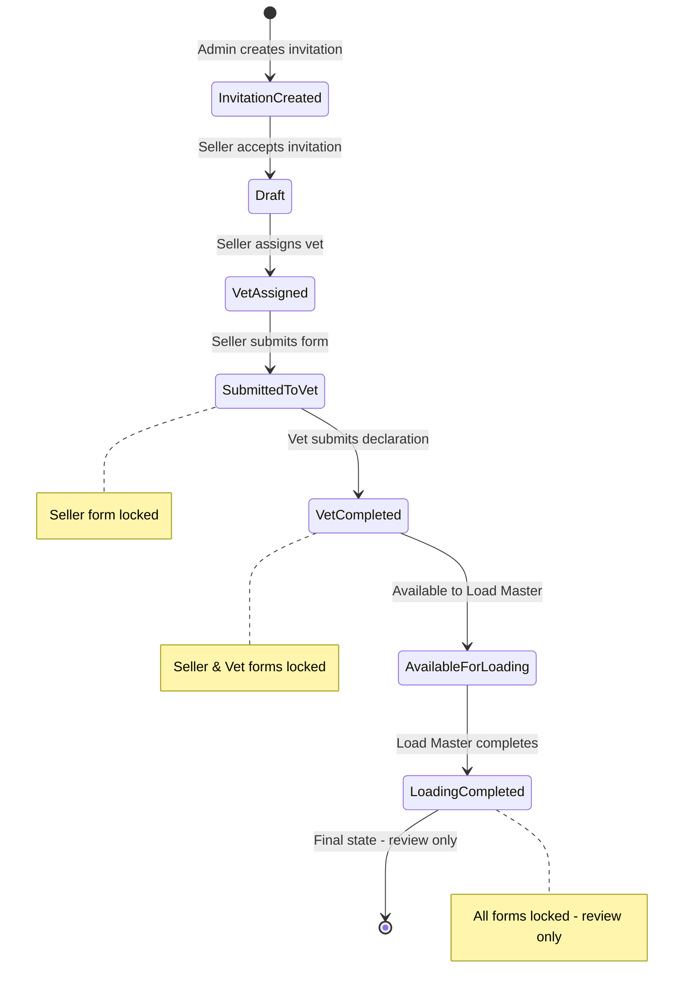
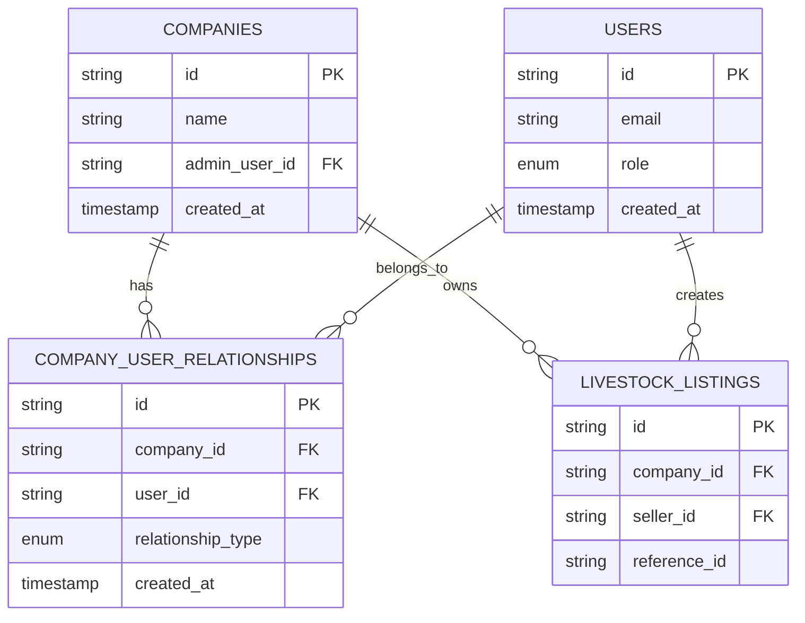

# Design Document

## Overview

The livestock form enhancements design addresses critical workflow, user experience, and data integrity issues in the cattle trading platform. The solution implements a state-driven architecture with role-based access controls, enhanced form management, and improved file handling capabilities while maintaining regulatory compliance for South African livestock trading.

## Architecture

### State Management Architecture

The system will implement a comprehensive state management system that tracks form states, user permissions, and workflow progression:



### Multi-Tenant Company-Based Architecture

The system implements a multi-tenant architecture where multiple livestock trading companies can operate independently while sharing certain resources (sellers, vets) across companies.



### Role-Based Access Control with Multi-Tenancy

The system will implement granular role-based permissions with company-level data isolation:

- **Super Admin**: Platform-wide access, first user to register, system management
- **Admin**: Company-specific access, user management within company, approval workflows for company listings
- **Seller/Farmer**: Can be associated with multiple companies, listing creation, limited editing based on state
- **Load Master**: Loading details management, transportation coordination
- **Veterinarian**: Can serve multiple companies, health declarations, compliance verification
- **Agent**: Offer management, buyer representation
- **Driver**: Transportation status updates

### Form State Locking Mechanism

Forms will implement a state-based locking system where different sections become read-only based on workflow progression and user roles.

## Components and Interfaces

### Form Simplification Strategy

The initial system launch will implement a modular approach where advanced features are hidden but remain in the database schema for future activation. This "Lego block" approach allows for incremental feature rollout based on user adoption and feedback.

#### Hidden Fields for Initial Launch
- Weaning status and duration
- Grain feeding information  
- Growth implant details
- Detailed breed information
- Estimated weight fields
- Weighing location (redundant with loading points)

#### Field Visibility Controller
```typescript
interface FieldVisibilityController {
  isFieldVisible(fieldName: string, context: FormContext): boolean;
  hideAdvancedFields(): void;
  showAdvancedFields(): void;
  getVisibleFields(section: FormSection): string[];
}
```

### Enhanced Form Components

#### 1. Livestock Location Manager
```typescript
interface LivestockLocationManager {
  herds: HerdLocation[];
  addHerd(): void;
  updateHerdLocation(herdId: string, location: LocationData): void;
  copyLocationData(sourceHerd: string, targetHerd: string): void;
}

interface HerdLocation {
  id: string;
  herdNumber: number;
  birthLocation: FarmAddress;
  currentLocation: FarmAddress;
  loadingPoints: LoadingPoint[];
  hasBeenMoved: boolean;
  movementHistory: MovementRecord[];
}

interface FarmAddress {
  farmName: string;
  portion?: string;
  district: string;
  province: string;
  fullAddress: string; // Accommodates complex SA farm addresses
}
```

#### 2. Form State Controller
```typescript
interface FormStateController {
  currentState: FormState;
  userRole: UserRole;
  canEdit(section: FormSection): boolean;
  canEditSeller(): boolean;
  canEditVet(): boolean;
  canEditLoadMaster(): boolean;
  lockSection(section: FormSection, reason: string): void;
  unlockSection(section: FormSection): void;
  getStateTransitions(): StateTransition[];
  isFormLocked(): boolean;
  getLockedSections(): FormSection[];
}

interface FormLockingRules {
  // Seller can edit until form is submitted to vet
  sellerCanEdit: FormState[];
  // Vet can edit only when form is submitted to them and not yet completed
  vetCanEdit: FormState[];
  // Load Master can edit only when vet has completed and loading not finished
  loadMasterCanEdit: FormState[];
  // All users can review in final state
  reviewOnlyStates: FormState[];
}

enum FormState {
  INVITATION_CREATED = 'invitation_created',
  DRAFT = 'draft',
  VET_ASSIGNED = 'vet_assigned',
  SUBMITTED_TO_VET = 'submitted_to_vet',
  VET_COMPLETED = 'vet_completed',
  AVAILABLE_FOR_LOADING = 'available_for_loading',
  LOADING_COMPLETED = 'loading_completed'
}
```

#### 3. File Upload Manager
```typescript
interface FileUploadManager {
  uploadBrandPhoto(file: File): Promise<UploadResult>;
  uploadVetLetterhead(file: File): Promise<UploadResult>;
  uploadAffidavit(file: File): Promise<UploadResult>;
  capturePhoto(type: DocumentType): Promise<CaptureResult>;
  validateFileType(file: File, allowedTypes: string[]): boolean;
}

interface UploadResult {
  success: boolean;
  fileUrl?: string;
  error?: string;
  fileId: string;
}
```

#### 4. Signature Pad Controller
```typescript
interface SignaturePadController {
  calibrateTouchInput(): void;
  adjustTouchOffset(device: DeviceInfo): TouchOffset;
  validateSignatureAccuracy(): boolean;
  resetSignaturePad(): void;
}

interface TouchOffset {
  x: number;
  y: number;
  scaleFactor: number;
}
```

### Mobile-First Responsive Design

#### Form Navigation Strategy
```typescript
interface ResponsiveFormNavigation {
  isMobile(): boolean;
  getTabLayout(): 'horizontal' | 'vertical' | 'dropdown';
  adjustTabsForViewport(): void;
  preventHorizontalScroll(): void;
}
```

#### Mobile Optimization Principles
- Vertical tab stacking for mobile devices
- Touch-friendly button sizes (minimum 44px)
- Signature pad calibration for accurate touch input
- Responsive form field layouts
- Optimized file upload for mobile cameras

### Dashboard Components

#### 1. Load Master Dashboard
```typescript
interface LoadMasterDashboard {
  pendingLoadings: LoadingSchedule[];
  completedLoadings: LoadingRecord[];
  updateLoadingDetails(loadingId: string, details: LoadingDetails): void;
  captureLoadingLocation(): Promise<GeolocationData>;
}

interface LoadingDetails {
  actualLoadingTime: Date;
  vehicleDetails: VehicleInfo;
  livestockCondition: string;
  loadingNotes: string;
  geolocation: GeolocationData;
}
```

#### 2. Multi-Tenant Dashboard Controller
```typescript
interface MultiTenantDashboardController {
  getUserCompanies(userId: string): Promise<Company[]>;
  getCompanyListings(companyId: string, userId: string): Promise<LivestockListing[]>;
  getCompanySellers(companyId: string): Promise<UserProfile[]>;
  getCompanyVets(companyId: string): Promise<UserProfile[]>;
  canUserAccessCompany(userId: string, companyId: string): Promise<boolean>;
  switchCompanyContext(userId: string, companyId: string): Promise<void>;
}
```

#### 3. Enhanced Role-Specific Dashboards
Each role will have tailored dashboard components showing relevant information and actions based on their responsibilities in the workflow, filtered by company relationships.

### Calculation Engine

#### 1. Automated Percentage Calculator
```typescript
interface CalculationEngine {
  calculateMouthingRequirement(totalCattle: number): MouthingRequirement;
  calculateAdditionalFees(turnover: number): FeeCalculation;
  validatePercentageCompliance(required: number, actual: number): ValidationResult;
}

interface MouthingRequirement {
  totalCattle: number;
  requiredPercentage: number;
  requiredCount: number;
  displayText: string;
}
```

## Data Models

### Multi-Tenant Company Model
```typescript
interface Company {
  id: string;
  name: string;
  adminUserId: string;
  createdAt: Date;
  settings: CompanySettings;
}

interface CompanySettings {
  allowCrossTenantSharing: boolean;
  defaultInvitationTemplate: string;
  companyBranding?: CompanyBranding;
}
```

### Company-User Relationship Model
```typescript
interface CompanyUserRelationship {
  id: string;
  companyId: string;
  userId: string;
  relationshipType: 'admin' | 'seller' | 'vet' | 'agent' | 'load_master';
  status: 'pending' | 'active' | 'inactive';
  invitedBy: string;
  createdAt: Date;
  acceptedAt?: Date;
}
```

### Enhanced User Profile Model
```typescript
interface UserProfile {
  id: string;
  email: string;
  role: UserRole;
  basicInfo: BasicUserInfo;
  roleSpecificInfo: RoleSpecificInfo;
  profileComplete: boolean;
  approvalStatus: ApprovalStatus;
  companyRelationships: CompanyUserRelationship[];
}

interface RoleSpecificInfo {
  // For Veterinarians
  practiceLetterhead?: File;
  registrationNumber?: string;
  
  // For Farmers/Sellers
  brandMark?: File;
  idNumber?: string;
  
  // For Load Masters
  transportLicense?: string;
  vehicleDetails?: VehicleInfo[];
}
```

### Multi-Tenant Invitation System
```typescript
interface InvitationManager {
  inviteNewUser(email: string, companyId: string, role: UserRole): Promise<InvitationResult>;
  inviteExistingUser(userId: string, companyId: string): Promise<InvitationResult>;
  checkUserExists(email: string): Promise<boolean>;
  sendRegistrationEmail(invitation: Invitation): Promise<void>;
  sendCompanyRelationshipEmail(invitation: Invitation): Promise<void>;
}

interface Invitation {
  id: string;
  companyId: string;
  invitedEmail: string;
  invitedUserId?: string; // null for new users
  invitedBy: string;
  role: UserRole;
  status: 'pending' | 'accepted' | 'expired';
  isNewUser: boolean;
  createdAt: Date;
  expiresAt: Date;
}
```

### Enhanced Livestock Listing Model
```typescript
interface LivestockListing {
  id: string;
  referenceId: string;
  companyId: string; // Associates listing with specific company
  sellerId: string;
  state: FormState;
  lockedSections: FormSection[];
  
  // Enhanced location management
  herds: HerdLocation[];
  
  // State tracking
  stateHistory: StateTransition[];
  editHistory: EditRecord[];
  
  // File attachments
  attachments: FileAttachment[];
  
  // Geolocation data
  submissionLocation?: GeolocationData;
  signatureLocation?: GeolocationData;
  
  // Multi-tenant access control
  visibleToCompanies: string[]; // Companies that can see this listing
}
```

### Geolocation Model
```typescript
interface GeolocationData {
  latitude: number;
  longitude: number;
  accuracy: number;
  timestamp: Date;
  address?: string; // Reverse geocoded address
}
```

## Error Handling

### Form State Validation
- Implement comprehensive validation for state transitions
- Prevent unauthorized state changes with clear error messages
- Validate role permissions before allowing actions

### File Upload Error Handling
- Handle network failures with retry mechanisms
- Validate file types and sizes before upload
- Provide clear feedback for upload failures

### Geolocation Error Handling
- Handle location permission denials gracefully
- Provide fallback options when GPS is unavailable
- Validate location accuracy and provide warnings for poor accuracy

## Testing Strategy

### Unit Testing
- Test form state transitions and locking mechanisms
- Test calculation engine accuracy
- Test file upload validation and processing
- Test role-based permission checks

### Integration Testing
- Test workflow state management across user roles
- Test file upload integration with storage systems
- Test geolocation capture and storage
- Test dashboard data loading and updates

### User Acceptance Testing
- Test form usability with complex South African farm addresses
- Test file upload workflows on mobile devices
- Test role-specific dashboard functionality
- Test workflow progression from seller to load master

### Performance Testing
- Test form performance with multiple herds and locations
- Test file upload performance for large images
- Test dashboard loading times with large datasets
- Test mobile responsiveness across different devices

## Security Considerations

### Role-Based Security
- Implement strict role validation for all actions
- Audit trail for all state changes and edits
- Secure file upload with virus scanning
- Validate user permissions at API level

### Data Integrity
- Implement form state locking at database level
- Validate all state transitions server-side
- Encrypt sensitive file uploads
- Maintain immutable audit logs

### Geolocation Privacy
- Request explicit permission for location access
- Store location data securely with encryption
- Provide options to disable location capture
- Clear disclosure of location data usage

## Implementation Phases

### Phase 1: Core State Management
- Implement form state controller
- Add role-based access controls
- Create state transition validation

### Phase 2: Enhanced Form Components
- Implement livestock location manager
- Add file upload capabilities
- Create calculation engine

### Phase 3: Dashboard Enhancements
- Build Load Master dashboard
- Enhance existing role dashboards
- Add workflow status indicators

### Phase 4: Advanced Features
- Implement geolocation capture
- Add automated calculations
- Enhance mobile responsiveness

## Migration Strategy

### Database Schema Updates
- Add form state tracking tables
- Add file attachment relationships
- Add geolocation data storage
- Add role-specific profile fields

### Data Migration
- Migrate existing listings to new state system
- Update user profiles with role-specific fields
- Preserve existing file attachments
- Maintain audit trail integrity

### Rollback Plan
- Maintain backward compatibility during transition
- Implement feature flags for gradual rollout
- Prepare rollback scripts for critical issues
- Monitor system performance during migration